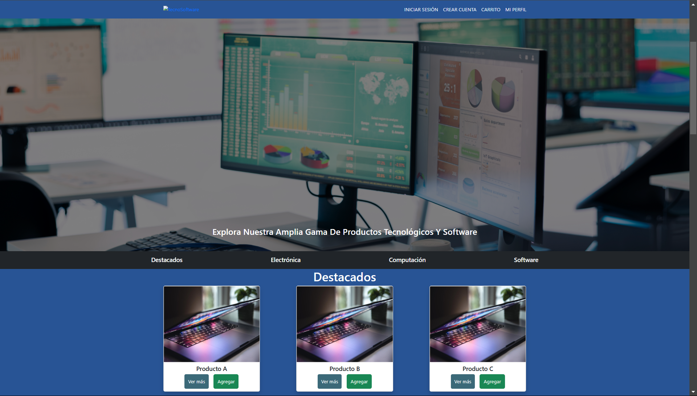

# Módulo 6 Introducción Express JS - Desafío 2 - Mi Repertorio

## Presentación del Desafío

##  

## Descripción del PY ⌨️

El proyecto final del e-commerce del Marketplace de Tecnología y Software “TecnoSoftware” en este segundo hito está enfocado en la venta y distribución de productos tecnológicos y software, creado por emprendedores que desean facilitar el acceso a soluciones digitales de vanguardia. La plataforma está diseñada para reunir a desarrolladores, startups, y pequeñas empresas tecnológicas, ofreciendo un espacio donde puedan presentar y comercializar sus productos de forma directa al consumidor.

Pre-requisitos para ejecutar el PY.

En la consola bash:

1. Intalar Node Js: https://nodejs.org/en/download/package-manager
2. Ejecutar npm i
3. Subir el servidor, ejecutando: npm run dev
4. Abrir en el navegador la url respectiva.

## Requerimientos entregados:

1. Se crea un nuevo proyecto con las dependencias acorde al diseño y temática definida en el hito 1.
2. Se crean los componentes para la reutilización de código y separación de secciones integrando los hooks necesarios que correspondan. Utilizamos React Router para la navegación entre rutas.
3. Reutilizamos componentes haciendo uso del paso de props y renderización dinámica.
4. Hacemos uso de los hooks para un desarrollo ágil y reactivo.
5. Utilizamos Context API para el manejo del estado global.
6. Preparamos la aplicación para el consumo de datos siguiendo el contrato definido en el hito 1.

##  

## Tecnologías Usadas 🛠️

- **Backend:** Node.js, Express.js, File System. 🧑‍💻
- **Frontend:** HTML, CSS, Bootstrap, Axios. 📚
- **Almacenamiento:** Archivo JSON (repertorio.json). 🫙

 

---

 

## Autores 👨‍💻

**Luis Fernando Sanchez F. - Daniel Hernández - Desarrolladores Fullstack G60⚡**

Sígueme en mis redes sociales: 
 
